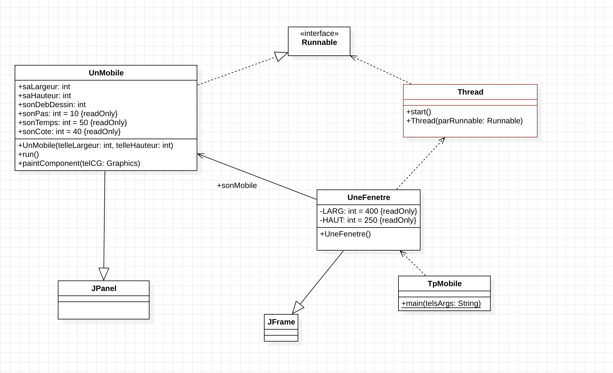
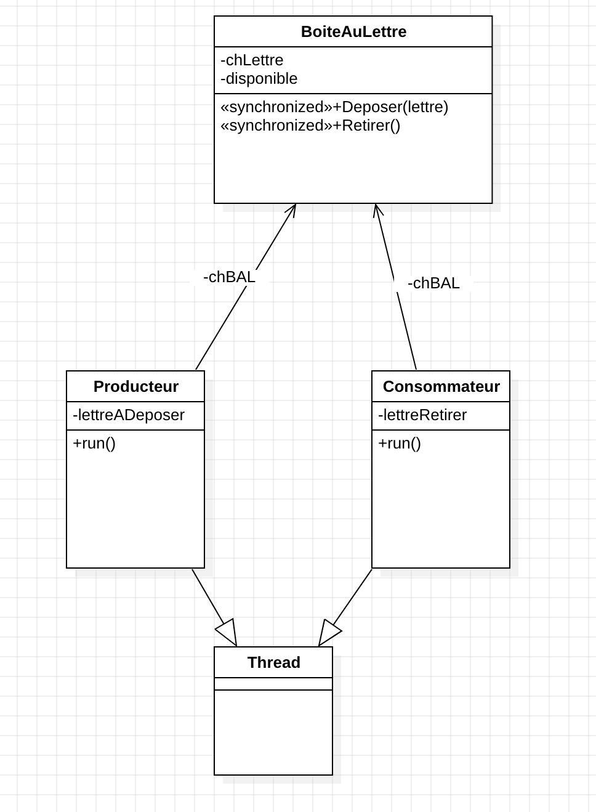

# Programmation Avancée

RUBIO Ilan INFA-3

Utilisation de Chat GPT pour la réalisation des TPs

## Sommaire

- [Introduction](#introduction)
- [TP0](#tp0)
- [TP1](#tp1)
- [TP2](#tp2)
- [TP3](#tp3)
- [Conclusion](#conclusion)

## Introduction
La programmation avancée joue un rôle fondamental dans le développement de compétences. 
Ce rapport met en avant mes réflexions lors de ces tps et quelques notions qui sont importantes.Il rend compte des différents travaux réalisés.
Pour ce faire, les codes sont à dispositions et renseignés ainsi que mes sources, me permettant de pouvoir retrouver des informations plus précises.

Ce rapport contient une partie pour chaque tp réalisé. Dans chaque partie, on retrovera des éléments de réponse au TP ainsi que des informations 
concernant différents thèmes du cours.
## TP0
Architecture matérielle des ordinateurs de la salle G26.

| Composant | Détails                                                          |
|-----------|------------------------------------------------------------------|
| **CPU**   | **Processeur :** Intel(R) Core(TM) i7-7700 CPU @ 3.60GHz         |
|           | **Vitesse de base :** 3,60 GHz                                   |
|           | **Sockets :** 1                                                  |
|           | **Cœurs :** 4                                                    |
|           | **Processeurs logiques :** 8                                     |
|           | **Virtualisation :** Activé                                      |
|           | **Cache de niveau 1 :** 256 Ko                                   |
|           | **Cache de niveau 2 :** 1,0 Mo                                   |
|           | **Cache de niveau 3 :** 8,0 Mo                                   |
|           | **Processus :** 121                                              |
|           | **Threads :** 1740                                               |
|           | **Handles :** 57051                                              |
| **RAM**   | **Mémoire :** 32,0 Go                                            |
|           | **Vitesse :** 2400 MHz                                           |
| **GPU**   | **GPU 0 :** Intel(R) HD Graphics 630                             |
|           | **Version du pilote :** 27.20.100.9664                           |
|           | **Version DirectX :** 12 (FL 12.1)                               |
|           | **Emplacement physique :** Bus PCI 0, périphérique 2, fonction 0 |

Architecture logicielle de mon téléphone Samsung S20 : 

| Composant      | Détails       |
|----------------|---------------|
| **Processeur** | Exynos 990    |
| **GPU**        | Mali-G77 MP11 |
| **RAM**        | 16 Go         |

Ce premier tp permet de mettre en avant les composants de chaques ordinateurs de la salle afin de comprendre au mieux leurs fonctionnements et leurs vitesse de réponses.
De plus, il permet de mettre en avant les différences qu'il y a entre les composants des ordinateurs/smartphones d'aujourd'hui par rapoort aux premiers existants.


## TP1


Pour ce tp1, le but était d'afficher dans un premier temps un module qui se déplace dans une fenêtre définie.

```java
class UnMobile extends JPanel implements Runnable {
    int saLargeur, saHauteur, sonDebDessin;
    final int sonPas = 10,  sonCote = 40;
    int sonTemps = (int) (Math.random() * ((40 - 5) + 1)) + 5;
    static semaphoreGlobal sem = new semaphoreGlobal(1);

    UnMobile(int telleLargeur, int telleHauteur) {
        super();
        saLargeur = telleLargeur;
        saHauteur = telleHauteur;
        setSize(telleLargeur, telleHauteur);
    }

    public void run() {
        for (sonDebDessin = 0; sonDebDessin < saLargeur - sonPas; sonDebDessin += sonPas) {
            repaint();
            try {
                Thread.sleep(sonTemps);
            } catch (InterruptedException telleExcp) {
                telleExcp.printStackTrace();
            }
        }
    }
    public void paintComponent(Graphics telCG) {
        super.paintComponent(telCG);
        telCG.fillRect(sonDebDessin, saHauteur / 2, sonCote, sonCote);
    }
}
```
Cette partie de code permet alors de créer un mobile et ses fonctionnalités. 
Pour ensuite l'instancier, il faut alors créer un objet un mobile dans une classe le permettant. 

Pour le créer et l'afficher, j'ai créé une classe `UneFenetre`. Dans cette classe, on instancie le mobile et le thread de ce mobile. 

Thread : unité d'exécution au sein d'un programme. Cela répresente une séquence de tâche pouvant être exécuté de manière indépendate au sein d'un processus.
En java, un Thread est instancié en utilisant son constructeur. 

```java
class UneFenetre extends JFrame {
    UnMobile sonMobile;
    private final int LARG = 400, HAUT = 250;

    public UneFenetre() {
        super("le Mobile");
        sonMobile = new UnMobile(LARG, HAUT);
        leContainer.add(sonMobile);

        // creer une thread laThread avec sonMobile
        Thread laTache = new Thread(sonMobile);
        laTache.start();
        
        setSize(3000, 2500);
        setVisible(true);
        // lancer laThread
    }
}
```

Pour lancer le mobile, la classe `TpMobile` permet de créer un objet Fenetre permettant ainsi de lancer une fenetre avec le mobile se déplaçant.

```java
public class TpMobile {
    public static void main(String[] telsArgs) {
        new UneFenetre();
    }
}
```

Pour que le mobile fasse le retour, il faut alors ajouter une boucle, dans la méthode run de la classe `UnMobile` permettant de faire le chemin dans le sens contraire. 

```java
public void run(){
    for (sonDebDessin = saLargeur - sonPas; sonDebDessin > 0; sonDebDessin -= sonPas) {
        repaint();
        try {
            Thread.sleep(sonTemps);
        } catch (InterruptedException telleExcp) {
            telleExcp.printStackTrace();
    }
}}
```

Pour la suite, j'ai créé deux autres mobiles qui effectuent le même mouvement que le premier. Pour se faire, il fallait instancier deux nouveaux mobiles dans la classe `UneFenetre`.
De plus, le chemin parcouru par ces trois mobiles étaient multiplié par 3. Ainsi, j'ai divisé en trois parties/colonnes pour le chemin des mobiles.
Donc j'ai utilisé un GridPane pour permettre de choisir le nombre de colonne voulu.
```java
class UneFenetre extends JFrame {
    UnMobile sonMobile;
    UnMobile sonMobile1;
    UnMobile sonMobile2;
    private final int LARG = 400, HAUT = 250;

    public UneFenetre() {
        // TODO
        super("le Mobile");
        Container leContainer = getContentPane();
        leContainer.setLayout(new GridLayout(3, 1));
        sonMobile = new UnMobile(LARG, HAUT);
        leContainer.add(sonMobile);

        // creer une thread laThread avec sonMobile
        Thread laTache = new Thread(sonMobile);
        laTache.start();

        sonMobile1 = new UnMobile(LARG, HAUT);
        leContainer.add(sonMobile1);
        Thread laTache1 = new Thread(sonMobile1);
        laTache1.start();

        sonMobile2 = new UnMobile(LARG, HAUT);
        leContainer.add(sonMobile2);
        Thread laTache2 = new Thread(sonMobile2);
        laTache2.start();

        setSize(3000, 2500);
        setVisible(true);
        // lancer laThread
    }
}
```
Pour permettre également aux mobiles de déplacer j'ai donc modifié la classe `UnMobile`, en créant de nouvelle boucle pour faire que les mobiles avancent et reviennent plus loin.

```java
public void run() {
        while (true) { //pour le faire tourner en permanence
            // du debut au premier tiers
            for (sonDebDessin = 0; sonDebDessin < saLargeur - sonPas; sonDebDessin += sonPas) {
                repaint();
                try {
                    Thread.sleep(sonTemps);
                } catch (InterruptedException telleExcp) {
                    telleExcp.printStackTrace();
                }
            }


            // premier tiers au deuxieme
            for (sonDebDessin = saLargeur; sonDebDessin < 2 * saLargeur - sonPas; sonDebDessin += sonPas) {
                repaint();
                try {
                    Thread.sleep(sonTemps);
                } catch (InterruptedException telleExcp) {
                    telleExcp.printStackTrace();
                }
            }

            // deuxieme tiers à la fin
            for (sonDebDessin = 2 * saLargeur; sonDebDessin < 3 * saLargeur - sonPas; sonDebDessin += sonPas) {
                repaint();
                try {
                    Thread.sleep(sonTemps);
                } catch (InterruptedException telleExcp) {
                    telleExcp.printStackTrace();
                }
            }

            // fin au deuxieme tiers
            for (sonDebDessin = 3 * saLargeur - sonPas; sonDebDessin > 2 * saLargeur; sonDebDessin -= sonPas) {
                repaint();
                try {
                    Thread.sleep(sonTemps);
                } catch (InterruptedException telleExcp) {
                    telleExcp.printStackTrace();
                }
            }

            //deuxieme tiers au premier
            for (sonDebDessin = 2 * saLargeur - sonPas; sonDebDessin > saLargeur; sonDebDessin -= sonPas) {
                repaint();
                try {
                    Thread.sleep(sonTemps);
                } catch (InterruptedException telleExcp) {
                    telleExcp.printStackTrace();
                }
            }

            //premier tiers au debut
            for (sonDebDessin = saLargeur - sonPas; sonDebDessin > 0; sonDebDessin -= sonPas) {
                repaint();
                try {
                    Thread.sleep(sonTemps);
                } catch (InterruptedException telleExcp) {
                    telleExcp.printStackTrace();
                }
            }
        }
    }
```

Par la suite, pour qu'un seul mobile puisse passer à la fois dans la colonne du milieu. J'ai du déterminer la section critique ainsi que la ressource critique.

`Une ressource critique est une ressource qui ne peut être utilisée que par
un seul processus à la fois. Par exemple une zone mémoire, ou une
imprimante.` cf - CM2 - Programmation parallèle


`Une section critique est portion de code dans laquelle ne s’exécute qu’un thread à la fois. Une
section critique est utilisée lorsque plusieurs thread accède à une même
ressource.` cf - CM2 - Programmation parallèle 

Ainsi dans ce code la section critique est la boucle suivante dans la classe `UnMobile`.
```java
public void run(){
    for (sonDebDessin = saLargeur; sonDebDessin < 2 * saLargeur - sonPas; sonDebDessin += sonPas) {
        repaint();
        try {
            Thread.sleep(sonTemps);
        } catch (InterruptedException telleExcp) {
            telleExcp.printStackTrace();
        }
    }
}
```

Ainsi pour empêcher l'accès à plusieurs mobiles dans cette deuxième colonne, j'ai utilisé une classe sémaphore pour permettre l'accès à un thread à la fois.

```Sémaphore : L'objectif est de contrôler l'accès à une ou plusieurs ressources.
Pour se faire : on utilise des :
- Sémaphore binaire : resource à accès unique
- Sémaphore général : ressource à accès multiple

Il y a deux primtives pour les gestions des accès avec :
- Wait() : permet l’accès à une ressource
- Signal() : permet la libération de la ressource

``` 
cf - CM2 - Programmation parallèle

Classe mère des sémaphores : 
```java
public abstract class semaphore {

    protected int valeur=0; // nombre de ressource

    protected semaphore (int valeurInitiale){
	valeur = valeurInitiale>0 ? valeurInitiale:0;
    } // ? -> contraction de if, then, else

    public synchronized void syncWait(){
	try {
	    while(valeur<=0){
		wait();
        }
	    valeur--;
	} catch(InterruptedException e){}
    }

    public synchronized void syncSignal(){
	if(++valeur > 0) notifyAll();
    }
}

```

Pour utiliser cette classe pour les mobiles, j'ai alors créé une classe `semaphoreGlobal`. Cette classe est une classe fille permettant de faire appel à la classe.
```java
public final class semaphoreGlobal extends semaphore{
    public semaphoreGlobal(int valeurInitiale){
        super(valeurInitiale);
    }
}
```

Ainsi pour empêcher que deux mobiles soient en même temps dans la colonne du milieu, il faut ajouter ses sémaphores avant et après les ressources critiques.
En utilisant les méthodes `syncWait()` avant la section critique et `syncSignal()` après la section critique, pour l'aller et le retour des mobiles.

```java
import java.awt.*;
import java.util.concurrent.Semaphore;
import javax.swing.*;

class UnMobile extends JPanel implements Runnable {
    int saLargeur, saHauteur, sonDebDessin;
    final int sonPas = 10,  sonCote = 40;
    int sonTemps = (int) (Math.random() * ((40 - 5) + 1)) + 5;
    static semaphoreGlobal sem = new semaphoreGlobal(1);

    UnMobile(int telleLargeur, int telleHauteur) {
        super();
        saLargeur = telleLargeur;
        saHauteur = telleHauteur;
        setSize(telleLargeur, telleHauteur);
    }

    public void run() {
        while (true) { //pour le faire tourner en permanence
            // du debut au premier tiers
            for (sonDebDessin = 0; sonDebDessin < saLargeur - sonPas; sonDebDessin += sonPas) {
                repaint();
                try {
                    Thread.sleep(sonTemps);
                } catch (InterruptedException telleExcp) {
                    telleExcp.printStackTrace();
                }
            }


            // premier tiers au deuxieme
            sem.syncWait();
            for (sonDebDessin = saLargeur; sonDebDessin < 2 * saLargeur - sonPas; sonDebDessin += sonPas) {
                repaint();
                try {
                    Thread.sleep(sonTemps);
                } catch (InterruptedException telleExcp) {
                    telleExcp.printStackTrace();
                }
            }
            sem.syncSignal();

            // deuxieme tiers à la fin
            for (sonDebDessin = 2 * saLargeur; sonDebDessin < 3 * saLargeur - sonPas; sonDebDessin += sonPas) {
                repaint();
                try {
                    Thread.sleep(sonTemps);
                } catch (InterruptedException telleExcp) {
                    telleExcp.printStackTrace();
                }
            }

            // fin au deuxieme tiers
            for (sonDebDessin = 3 * saLargeur - sonPas; sonDebDessin > 2 * saLargeur; sonDebDessin -= sonPas) {
                repaint();
                try {
                    Thread.sleep(sonTemps);
                } catch (InterruptedException telleExcp) {
                    telleExcp.printStackTrace();
                }
            }

            //deuxieme tiers au premier
            sem.syncWait();
            for (sonDebDessin = 2 * saLargeur - sonPas; sonDebDessin > saLargeur; sonDebDessin -= sonPas) {
                repaint();
                try {
                    Thread.sleep(sonTemps);
                } catch (InterruptedException telleExcp) {
                    telleExcp.printStackTrace();
                }
            }
            sem.syncSignal();

            //premier tiers au debut
            for (sonDebDessin = saLargeur - sonPas; sonDebDessin > 0; sonDebDessin -= sonPas) {
                repaint();
                try {
                    Thread.sleep(sonTemps);
                } catch (InterruptedException telleExcp) {
                    telleExcp.printStackTrace();
                }
            }
        }
    }

    public void paintComponent(Graphics telCG) {
        super.paintComponent(telCG);
        telCG.fillRect(sonDebDessin, saHauteur / 2, sonCote, sonCote);
    }
}
```

Afin de mieux apercevoir les arrêts de mobiles, j'ai alors décidé de donner à chaque mobiles de vitesses différentes en modifiant leurs temps avec le code suivant : 
```java
int sonTemps = (int) (Math.random() * ((40 - 5) + 1)) + 5;
```

Ainsi, les mobiles sont fonctionnels et fonctionnent sur 3 colonnes, avec un seul mobile à la fois circulant dans celle du milieu.
Vous pouvez essayer les mobiles avec `TpMobile`.

## TP2
Ce tp a été réalisé en 3 étapes principales : 
- Dans un premier temps, on a utilisé une classe Exclusion
- Ensuite, on a utilisé la méthode synchronized
- Enfin, on a créé des classes sémaphores et on l'a utilisé


**Les principes du Verrou MUTEX** : 
- Un seul processus peut se trouver en section critique à un instant t
- Lorsqu'un processus est bloqué hors d'une section critique, alors un autre processus peut entrer en section critique
- Si plusieurs ressources critiques bloquées en attente d'entrée en section critique et aucun processus en section critique alors 
un des processus en attente peut entrer dans la section critique.
- La solution est la même pour tous les processus

Ces quatres principes forment le verrou MUTEX.
cf - CM2 - Programmation parallèle


1. Avec la classe Exclusion

```java
class Exclusion{};
public class Affichage extends Thread{
	String texte;
	static semaphoreBinaire sem = new semaphoreBinaire(1);
        
	static Exclusion exclusionMutuelle = new Exclusion();

	public Affichage (String txt){texte=txt;}
	
	public void run(){
	    for (int i=0; i<texte.length(); i++){
		    System.out.print(texte.charAt(i));
		    try {sleep(400);} catch(InterruptedException e){};
		}
	}
}
```

La classe Exclusion permet de contrôler l'accès aux ressources.

2. La méthode synchronized

Cette méthode permet de contrôler l'accès aux ressources partagées. C'est-à-dire que la méthode permet de garantir qu'un seul thread à la fois peut accéder à une section critique.

Afin de pouvoir utiliser la méthode synchronized, il faut dans un premier temps repérer la section critique afin de pouvoir l'isoler
et appliquer la méthode sur la bonne portion de code.

```java
public class Affichage extends Thread{
	String texte;
	static semaphoreBinaire sem = new semaphoreBinaire(1);

	public Affichage (String txt){texte=txt;}
	
	public void run(){
	    for (int i=0; i<texte.length(); i++){
		    System.out.print(texte.charAt(i));
		    try {sleep(400);} catch(InterruptedException e){};
		}
	}
}
```
On peut repérer que dans la méthode run, la section critique est la boucle for avec comme ressource critique le `System.out`.

Il faut ainsi alors utiliser la méthode synchronized sur cette partie de code.
```java
public void run(){
    synchronized (System.out) { //section critique
	    for (int i=0; i<texte.length(); i++){
		    System.out.print(texte.charAt(i));
		    try {sleep(400);} catch(InterruptedException e){};
		}
    }
}
```

3. Sémaphore

Pour changer de la méthode synchronized, on peut utiliser des sémaphores.
On instancie une classe mère `semaphore` et une classe fille `semaphoreBinaire`.

```java
public abstract class semaphore {

    protected int valeur=0; // nombre de ressource

    protected semaphore (int valeurInitiale){
	valeur = valeurInitiale>0 ? valeurInitiale:0;
    } // ? -> contraction de if, then, else

    public synchronized void syncWait(){
	try {
	    while(valeur<=0){
		wait();
        }
	    valeur--;
	} catch(InterruptedException e){}
    }

    public synchronized void syncSignal(){
	if(++valeur > 0) notifyAll();
    }
}

```

De cette classe, on instancie la classe fille `semaphoreBinaire`.
```java

public final class semaphoreBinaire extends semaphore {
public semaphoreBinaire(int valeurInitiale){
	super((valeurInitiale != 0) ? 1:0);
	//System.out.print(valeurInitiale);
}
public final synchronized void syncSignal(){
	super.syncSignal();
	//System.out.print(valeur);
	if (valeur>1) valeur = 1;
}
}
```

Cette classe permet :
- un accès exclusif d'un seul thread à une ressource partagée.
- de s'assurer que la valeur ne dépasse jamais 1, et donc qu'un seul thread peut "libérer" ou "signaler" le sémaphore à la fois, grâce à l'utilisation de SyncSignal.
- de gérer correctement les threads pour éviter des conflits, grâce à la synchronisation permis dans la méthode syncSignal.

Pour utiliser les sémaphores dans cette classe `Affichage`, il faut modifier le code pour utiliser les méthodes syncSignal et syncWait.
```java
public class Affichage extends Thread{
	String texte;
	static semaphoreBinaire sem = new semaphoreBinaire(1);
    
	public Affichage (String txt){texte=txt;}
	
	public void run(){
		sem.syncWait();
	    for (int i=0; i<texte.length(); i++){
		    System.out.print(texte.charAt(i));
		    try {sleep(400);} catch(InterruptedException e){};
		}
		sem.syncSignal();
	}
}
```

Pour voir l'affichage de ce tp, on peut utiliser la méthode `MainTP3`.

## TP3


Pour ce tp, je me suis aidé du site https://blog.paumard.org/cours/java-api/chap05-concurrent-queues.html

Ce site donne un exemple avec une boulangerie alors que sur le TP, il faut le faire avec une boite au lettre.

Le producteur dépose la lettre et le consommateur lit la lettre.

Pour le TP, j'ai alors écrit 3 classes `BoiteAuLettre`, `Consommateur` et `Producteur`.
Il y a également la classe `MainTP3` pour lancer les threads.

Dans ces classes, j'ai repéré que les ressources critiques se trouvent dans les classes `Producteur` et `Consommateur`.

```java
public class Producteur implements Runnable {
    private final BoiteAuLettre bal;
    private semaphoreGlobal semaphore;

    public Producteur(BoiteAuLettre bal, semaphoreGlobal semaphore) {
        this.bal = bal;
        this.semaphore = semaphore;
    }

    @Override
    public void run() {
        try (Scanner scanner = new Scanner(System.in)) {
            String lettre;
            do {
                Thread.sleep(1000);
                semaphore.syncWait();
                System.out.print("Entrez une lettre (Q pour quitter) : ");
                lettre = scanner.nextLine();
                bal.deposer(lettre);
                semaphore.syncSignal();
            } while (!lettre.equals("Q"));
        } catch (InterruptedException e) {
            Thread.currentThread().interrupt();
        }
    }
}

```
Dans cette classe, on peut remarquer que la section critique se trouve le do, de la méthode run.
Ainsi, il faut alors placer `semaphore.syncWait()` avant cette ressource et `semaphore.syncSignal()` à la fin de cette ressource.

On retrouve le même principe sur la classe `Consommateur`.

```java
public class Consommateur implements Runnable {
    private final BoiteAuLettre bal;
    private semaphoreGlobal semaphore;

    public Consommateur(BoiteAuLettre bal, semaphoreGlobal semaphore) {
        this.bal = bal;
        this.semaphore=semaphore;
    }

    @Override
    public void run() {
        try {
            String lettre;
            do {
                Thread.sleep(1000);
                semaphore.syncWait();
                lettre = bal.retirer();
                System.out.println("Lettre lue : " + lettre);
                semaphore.syncSignal();
            } while (!lettre.equals("Q"));
        } catch (InterruptedException e) {
            Thread.currentThread().interrupt();
        }
    }
}
```

Pour la suite, il fallait utiliser la classe BlockingQueue de Java, pour implémenter différemment la BAL.
Pour ce faire, je me suis alors aidé et inspiré du site mentionné plus tôt.

```java
public class BoiteAuLettre {
    private String chLettre;
    private Boolean disponible = false;
    private BlockingQueue<String> tampon;

    public BoiteAuLettre(int capacite) {
        this.tampon = new ArrayBlockingQueue<>(capacite);
    }

    public synchronized void deposer(String lettre) throws InterruptedException {
        tampon.put(lettre); // Bloque si le tampon est plein
        System.out.println("BAL : Lettre déposée -> " + lettre);
    }
    public synchronized String retirer() throws InterruptedException {
        String lettre = tampon.take(); // Bloque si le tampon est vide
        System.out.println("BAL : Lettre retirée -> " + lettre);
        return lettre;
    }

}
```

J'ai donc fait appel à la classe et je l'ai instancié.

## Conclusion
Ces tps m'ont permis de mettre en application les notions vu en cours concernant la programmation parallèle, les threads.
De plus, j'ai pu comprendre et identifier les sections critiques dans une portion de code.
