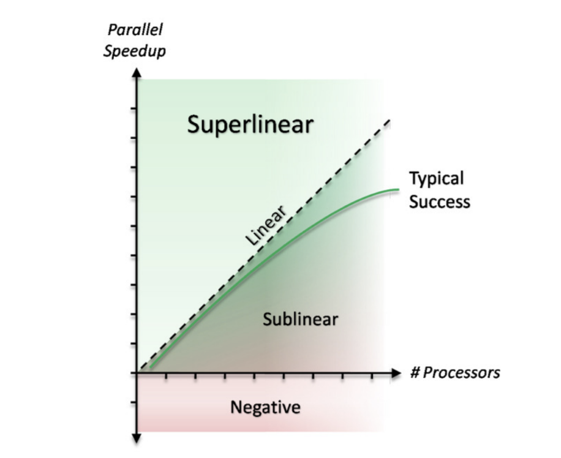

# Programmation Avancée - Rapport n°2

RUBIO Ilan INFA-3

## Introduction

Ce rapport examine l'application de la technique de Monte Carlo pour estimer la valeur de π. 
La méthode consiste à générer des points aléatoires dans un espace défini, 
puis à calculer le rapport entre les points situés à l'intérieur d'une région d'intérêt et ceux situés à l'intérieur de l'espace total. 
Cette approche est particulièrement utile pour des problématiques complexes où une solution analytique est difficile à obtenir.

Pour réaliser ce rapport, des intelligences artificielles ont été utilisées.

## Monte Carlo pour calculer π

Calcul de Pi par une méthode de Monte Carlo.

### Généralités

#### Monte Carlo Histoire
La méthode de Monte Carlo tire son nom du fameux casino de Monte Carlo, en raison de son utilisation intensive du hasard. 
Elle a été largement développée au cours du XXe siècle, notamment par les chercheurs du projet Manhattan pour modéliser des phénomènes complexes.

Aujourd'hui, cette méthode est employée dans de nombreux domaines scientifiques, notamment en physique, en finance et en géophysique. 
Par exemple, les géophysiciens utilisent cette technique pour modéliser l'écoulement de l'eau dans les nappes souterraines.

#### Principe du calcul de π par Monte Carlo


L'idée fondamentale est d'utiliser la probabilité d'un point aléatoirement placé dans un carré pour estimer π.

1. Considérons un carré de côté 1 inscrit dans un repère orthonormé.

2. Un quart de cercle est tracé à l'intérieur de ce carré, avec un rayon de 1.

3. On génère un grand nombre de points aléatoires à l'intérieur du carré.

4. On compte combien de ces points tombent à l'intérieur du quart de cercle, en vérifiant si la condition :
```x²+y² <= 1 ``` est satisfaite.

Le rapport entre le nombre de points à l'intérieur du quart de cercle et le nombre total de points permet d'estimer π en utilisant la relation suivante :
```π ≈ 4 * ncible/ntotal```

L'aire du quart de disque s'écrit A d/4 = πr²/4 = π/4


**Figure 1 :** illustre le tirage aléatoire de point xp de coordonnées
(xp,yp) où xp, yp suivent une loi (]0,1[).

La probabilité qu'un point Xp soit dans le quart de disque est telle que 

```P(Xp|dp<1)=(Ad/4)/Ac = π/4```

On effectue n_total tirage. Si n_total est grand alors on approche 
```P(Xp|dp<1) ≈ ncible/ntotal```.

Avec ncible le nombre de points dans la cible.

On peut alors approcher π par ```π≈4* ncible/n_total```.


### Algorithme  : Monte Carlo

On écrit alors l'algorithme :
```
n_cible=0
//générer et compter n_cible
for p=0 : n_total-1
    générer xp;
    générer yp;
    if xp²+yp² < 1 then
        ncible ++;
    endif
endfor
//calculer PI
PI = 4*(n_cible/ntotal);
```
Dans cette version de l'algorithme tout est executé séquentiellement.
Afin de l'améliorer et pouvoir le paralléliser, il faut dans un premier temps déterminer quelles sont les différents tâches.

On remarque alors 2 tâches : 
1. **Tâche 1** : Générer et compter n_cible


Cette première tâche contient alors 2 sous tâches : 
* Sous tâche 1 : Générer xp et yp
* Sous tâche 2 : Incrémenter ncible si ````xp²+yp² < 1````

2. **Tâche 2** : Calculer pi

Dans ces tâches, on peut alors remarquer des dépendances.
* La tâche 2 ne peut être effectuée tant que la tâche 1 n'est pas terminée.
* La sous tâche 2 dépend de la première, le point doit être généré avant de savoir s'il est dans la zone souhaitée.

En déterminant ces dépendances, on peut alors remarquer une section critique dans cet algrtihme :
```
if xp²+yp² < 1 then
        ncible ++;
    endif
```
On peut donc en déduire que ```ncible ``` est une ressource critique. Cette ressource doit ainsi être protégée pour éviter des conflits.

### Parallélisation
Pour ce code, on a utilisé deux paradigmes, le parallélisme d'itération parallèle (parallélisme de boucle) et le paradigme Master/Worker.

#### Parallélisme de boucle

PLe parallélisme de boucle est un paradigme de programmation parallèle qui permet d'exécuter plusieurs itérations d'une boucle simultanément. 
Dans le cas de la méthode de Monte Carlo, chaque itération génère un point aléatoire et vérifie s'il se situe à l'intérieur du cercle. 
En exécutant ces itérations en parallèle, on peut accélérer le calcul de π.

On peut retrouver ce paradigme avec le code Assignement102.

#### Master/Worker
Le paradigme Master/Worker fonctionne ainsi :

* Workers : Chaque worker se voit attribuer une tâche spécifique. Dans notre cas, il s'agit de réaliser n tirages aléatoires.
* Master : Il distribue les tâches aux workers et traite les résultats. Ici, il effectue le calcul : ```4 * ncible/ntotal```
* Nous avons donc n processus workers indépendants exécutant simultanément n_total tirages aléatoires chacun. 
Une fois tous les workers ayant terminé leur tâche, le master estime la valeur de π.


Ce schéma représente le fonctionnement de ce paradigme. 

On peut retrouver ce code avec le code Pi.java.

## Java

### Assignement102

#### Fonctionnement


#### Scalabilité forte


#### Scalabilité faible

**refaire le graphe**
#### Comparaison


#### Erreur
**Prendre les données et faire les graphes**

### Pi.java
**FAIRE UML**

#### Fonctionnement
#### Scalabilité forte


#### Scalabilité faible

#### Comparaison

#### Erreur

### MasterSocket / WorkerSocket

#### Fonctionnement

#### Scalabilité forte
**Prendre les données et faire les graphes**
#### Scalabilité faible
**Prendre les données et faire les graphes**
#### Erreur
**Prendre les données et faire les graphes**

## Définition

* **Speedup** : L’accélération Sp est le gain de vitesse d’exécution en fonction du nombre
  de processus P. On l’exprime comme le rapport du temps d’éxécution sur
  un processus T1, sur le temps d’exécution sur P processus, Tp. On le calcule avec ```Sp = T1/Tp```
On peut le représenter avec la courbe suivante :
  

* **Scalabilité forte** : La scalabilité forte évalue la capacité d’un programme à diminuer son temps d’exécution lorsque le nombre de cœurs augmente, tout en conservant une charge de travail constante. 
Elle mesure ainsi l’efficacité avec laquelle le programme utilise les ressources supplémentaires.

* **Scalabilité faible** : La scalabilité faible mesure la capacité d’un programme à maintenir un temps d’exécution stable lorsque la charge de travail et le nombre de cœurs augmentent. 
Elle évalue dans quelle mesure le programme peut traiter efficacement une charge de travail croissante en exploitant davantage de ressources.