# Programmation Avancée - Rapport n°2

RUBIO Ilan INFA-3

## Introduction

Ce rapport examine l'application de la technique de Monte Carlo pour estimer la valeur de π. 
La méthode consiste à générer des points aléatoires dans un espace défini, 
puis à calculer le rapport entre les points situés à l'intérieur d'une région d'intérêt et ceux situés à l'intérieur de l'espace total. 
Cette approche est particulièrement utile pour des problématiques complexes où une solution analytique est difficile à obtenir.

Pour réaliser ce rapport, des intelligences artificielles ont été utilisées.

### Configuration machine

Pour effectuer toutes les mesures, j'ai utilisé une machine en G26 avec la configuration suivante :

| Composant         | Détails                                 |
|-------------------|-----------------------------------------|
| RAM               | 32 GB                                   |
| Processeur        | Intel(R) Core(TM) i7-7700 CPU @ 3.60GHz |
| Coeurs            | 4 coeurs physique                       |
| Cache de niveau 1 | 256 Ko                                  |
| Cache de niveau 2 | 1,0 Mo                                  |
| Cache de niveau 3 | 8,0 Mo                                  |

## Monte Carlo pour calculer π

Calcul de Pi par une méthode de Monte Carlo.

### Généralités

#### Monte Carlo Histoire
La méthode de Monte Carlo tire son nom du fameux casino de Monte Carlo, en raison de son utilisation intensive du hasard. 
Elle a été largement développée au cours du XXe siècle, notamment par les chercheurs du projet Manhattan pour modéliser des phénomènes complexes.

Aujourd'hui, cette méthode est employée dans de nombreux domaines scientifiques, notamment en physique, en finance et en géophysique. 
Par exemple, les géophysiciens utilisent cette technique pour modéliser l'écoulement de l'eau dans les nappes souterraines.

#### Principe du calcul de π par Monte Carlo


L'idée fondamentale est d'utiliser la probabilité d'un point aléatoirement placé dans un carré pour estimer π.

1. Considérons un carré de côté 1 inscrit dans un repère orthonormé.

2. Un quart de cercle est tracé à l'intérieur de ce carré, avec un rayon de 1.

3. On génère un grand nombre de points aléatoires à l'intérieur du carré.

4. On compte combien de ces points tombent à l'intérieur du quart de cercle, en vérifiant si la condition :
```x²+y² <= 1 ``` est satisfaite.

Le rapport entre le nombre de points à l'intérieur du quart de cercle et le nombre total de points permet d'estimer π en utilisant la relation suivante :
```π ≈ 4 * ncible/ntotal```

L'aire du quart de disque s'écrit A d/4 = πr²/4 = π/4

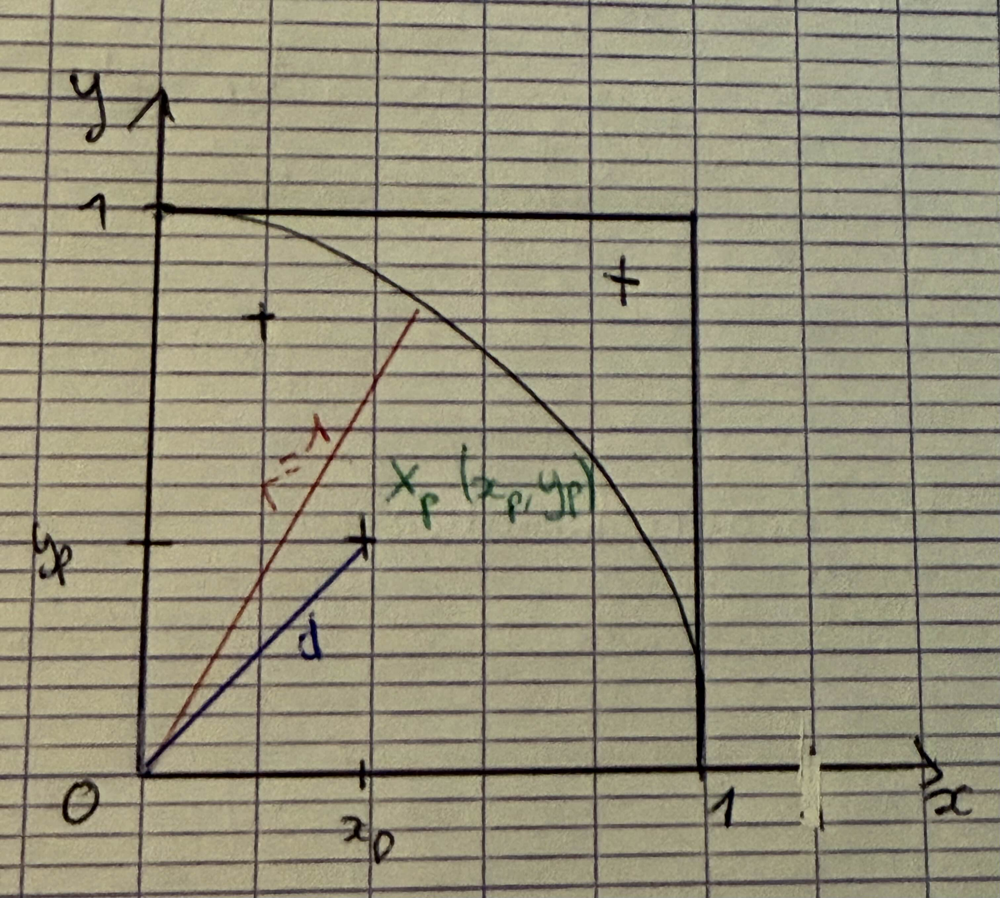


**Figure 1 :** illustre le tirage aléatoire de point xp de coordonnées
(xp,yp) où xp, yp suivent une loi (]0,1[).

La probabilité qu'un point Xp soit dans le quart de disque est telle que 

```P(Xp|dp<1)=(Ad/4)/Ac = π/4```

On effectue n_total tirage. Si n_total est grand alors on approche 
```P(Xp|dp<1) ≈ ncible/ntotal```.

Avec ncible le nombre de points dans la cible.

On peut alors approcher π par ```π≈4* ncible/n_total```.


### Algorithme  : Monte Carlo

On écrit alors l'algorithme :
```
n_cible=0
//générer et compter n_cible
for p=0 : n_total-1
    générer xp;
    générer yp;
    if xp²+yp² < 1 then
        ncible ++;
    endif
endfor
//calculer PI
PI = 4*(n_cible/ntotal);
```
Dans cette version de l'algorithme tout est executé séquentiellement.
Afin de l'améliorer et pouvoir le paralléliser, il faut dans un premier temps, déterminer quelles sont les différentes tâches.

On remarque alors 2 tâches : 
1. **Tâche 1** : Générer et compter n_cible


Cette première tâche contient alors 2 sous tâches : 
* Sous tâche 1 : Générer xp et yp
* Sous tâche 2 : Incrémenter ncible si ````xp²+yp² < 1````

2. **Tâche 2** : Calculer pi

Dans ces tâches, on peut alors remarquer des dépendances.
* La tâche 2 ne peut être effectuée tant que la tâche 1 n'est pas terminée.
* La sous tâche 2 dépend de la première, le point doit être généré avant de savoir s'il est dans la zone souhaitée.

En déterminant ces dépendances, on peut alors remarquer une section critique dans cet algrtihme :
```
if xp²+yp² < 1 then
        ncible ++;
    endif
```
On peut donc en déduire que ```ncible ``` est une ressource critique. Cette ressource doit ainsi être protégée pour éviter des conflits.

### Parallélisation
Pour ce code, on a utilisé deux paradigmes, le parallélisme d'itération parallèle (parallélisme de boucle) et le paradigme Master/Worker.

#### Parallélisme de boucle

PLe parallélisme de boucle est un paradigme de programmation parallèle qui permet d'exécuter plusieurs itérations d'une boucle simultanément. 
Dans le cas de la méthode de Monte Carlo, chaque itération génère un point aléatoire et vérifie s'il se situe à l'intérieur du cercle. 
En exécutant ces itérations en parallèle, on peut accélérer le calcul de π.

On peut retrouver ce paradigme avec le code Assignement102.

#### Master/Worker
Le paradigme Master/Worker fonctionne ainsi :

* Workers : Chaque worker se voit attribuer une tâche spécifique. Dans notre cas, il s'agit de réaliser n tirages aléatoires.
* Master : Il distribue les tâches aux workers et traite les résultats. Ici, il effectue le calcul : ```4 * ncible/ntotal```
* Nous avons donc n processus workers indépendants exécutant simultanément n_total tirages aléatoires chacun. 
Une fois tous les workers ayant terminé leur tâche, le master estime la valeur de π.

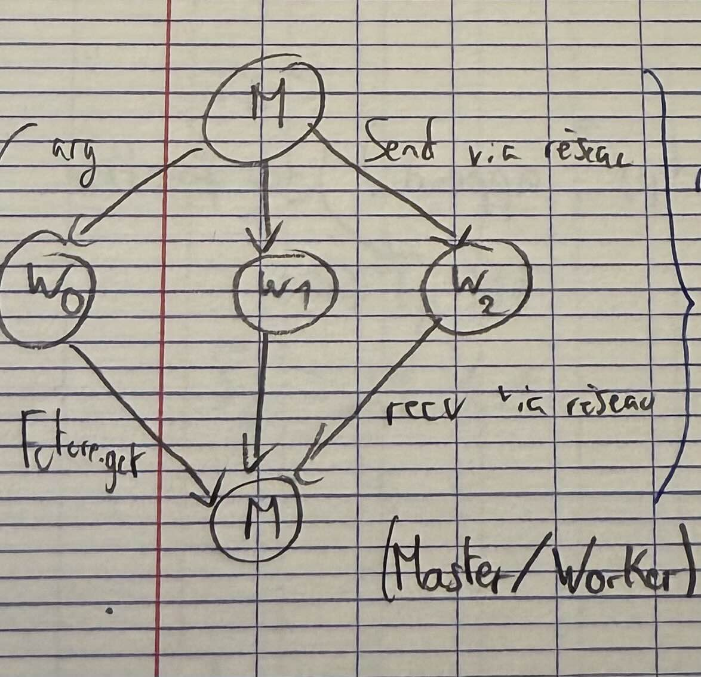
Ce schéma représente le fonctionnement de ce paradigme. 

On peut retrouver ce code avec le code Pi.java.

## Java

### Assignement102
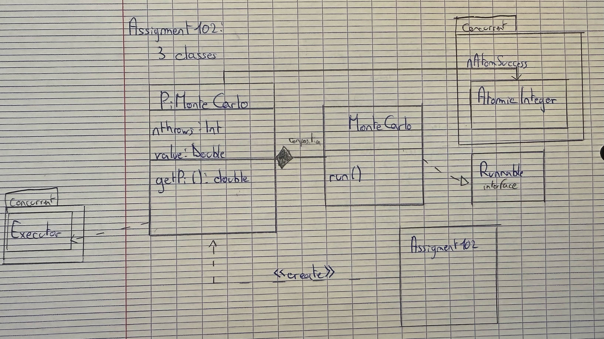

#### Fonctionnement


La classe ```PiMonteCarlo```gère l'exécution du calcul de Monte-Carlo en utilisant le parallélisme avec l'API Concurrent.
Cette classe contient une classe interne ```MonteCarlo```. Cette classe implémente Runnable.

* Simule un tirage de coordonnées (x, y) et vérifie s'il tombe dans le quart de cercle.
* Si ```x²+y² <= 1 ```, alors le point est dans le cercle et on incrémente nAtomSuccess.

La classe ```Assignment102``` : 
* Instancie un objet ```PiMonteCarlo``` avec deux paramèetres le nombre de lancers et le nombre de threads.
* Mesure le temps d'exécution.
* Retourne le résultat

#### Scalabilité forte
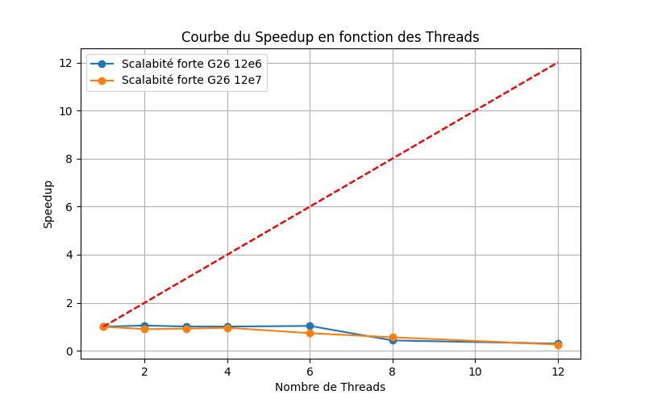
On peut voir que la scalabilité forte est très mauvaise. On remarque qu'elle est presque constante malgré une baisse 
lorsque l'on passe à 6 processus.

On peut donc en déduire que ce code n'est pas efficace. C'est-à-dire que la parallélisation
ne permet pas de rendre ce code plus performant et ainsi d'estimer Pi plus rapidement.

#### Scalabilité faible
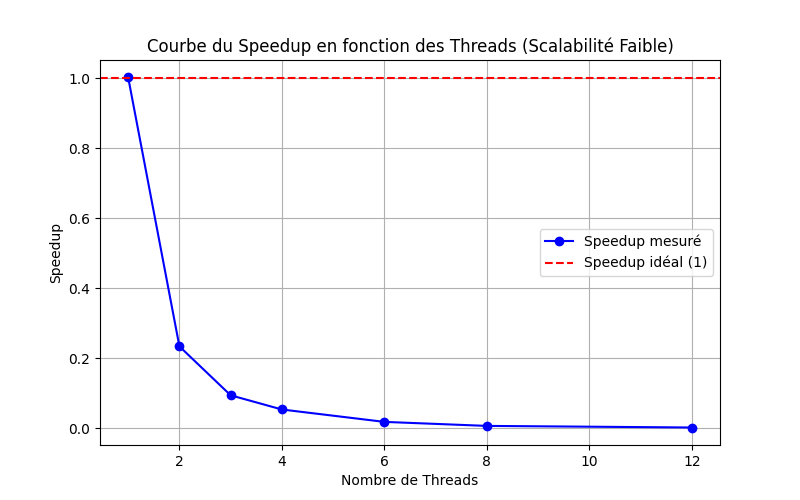

À partir de 2 threads, la performance se dégrade fortement, atteignant presque zéro 


#### Comparaison
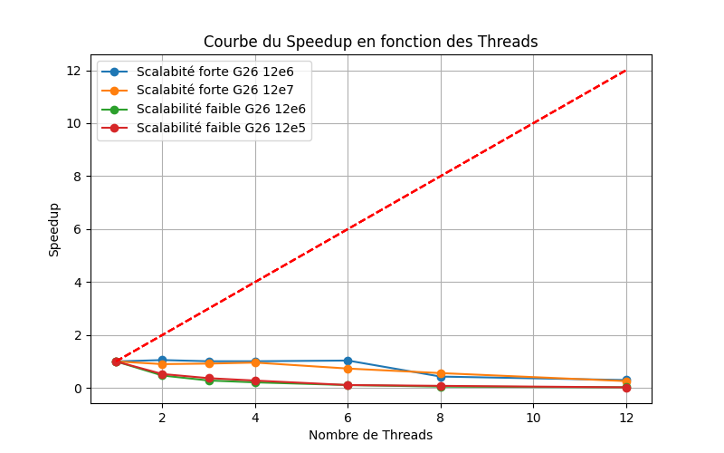

On peut remarquer que les graphes de scalabilités fortes et faibles sont presque équivalentes.
Cela peut s'expliquer par le fait la parallélisation de code n'est pas efficace.
En effet, la majeure partie de temps de calculs de ce fait dans la section critique.
Cela empêche de pouvoir paralléliser efficacement ce code.

#### Erreur
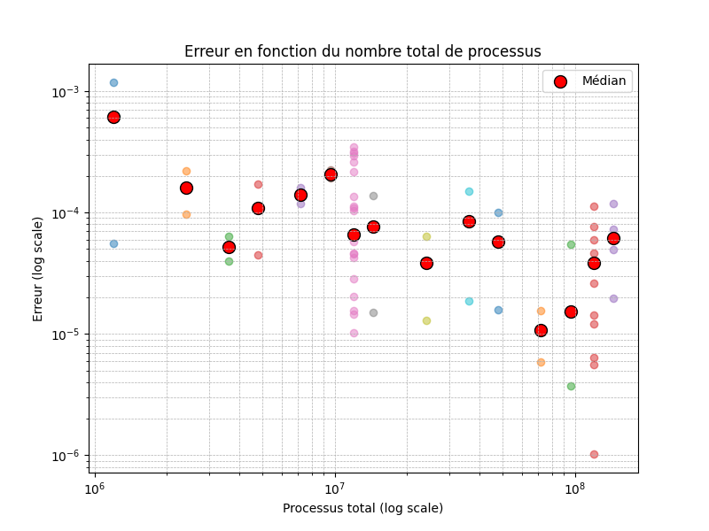

On peut remarquer que l'erreur a une tendance à diminuer lorsque le nombre de processus augmente.

#### Amélioration

Ce code ne se parallélise pas très bien, car une majorité des calculs se font en ressource critique.
Une manière de l'améliorer est de faire les calculs pour les points hors de la cible. Ainsi, on effectuera un calcul sur 25% au lieu de 75% en ressource critique.

### Pi.java
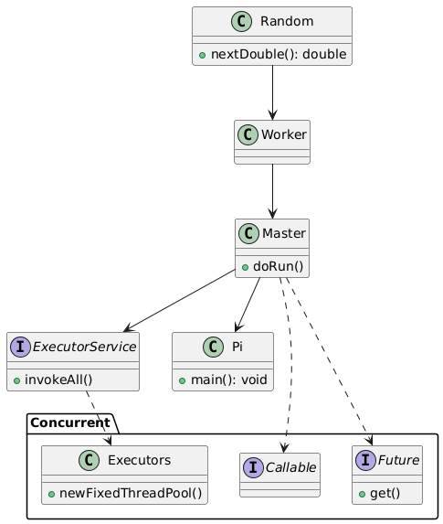

#### Fonctionnement

Repose sur l'implémentation de Callable et de Futures.

``Classe Pi``
* Elle récupère les arguments d'entrée (nombre d'itérations et nombre de threads).
* Elle exécute l'approximation via la classe Master.

``Classe Master``
* Cette classe orchestre l'exécution parallèle des tâches en : 
  * Créant une liste de tâches ``List<Callable<Long>>``
  * Les exécutant avec un ``ExecutorService``
  * Récupérant les résultats et calculant 𝜋
* S'assure de l'exécution parallèle des tâches.
* S'occupe de la récupération des résultats et calcul de π.

``Classe Worker``
* Chaque thread exécute une instance de ``Worker`` qui :
  * Génère ``numIterations`` points aléatoires.
  * Compte combien tombent dans le quart de cercle.

#### Scalabilité forte

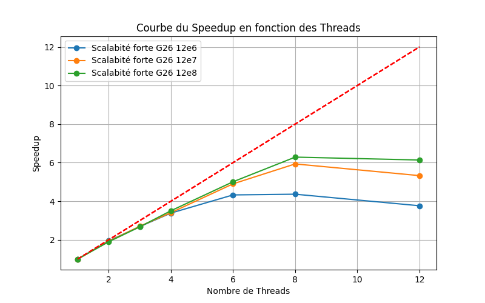

Les courbes montrent que la scalabilité forte est meilleure avec un plus grand nombre de points (12e8 > 12e7 > 12e6).
On remarque également qu'elle est bonne jusqu'à 4 processus puis qu'elle diminue en augmentant le nombre de processus.
#### Scalabilité faible

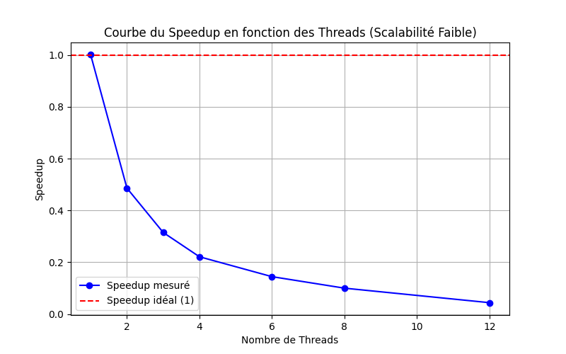
La courbe décroissante confirme un problème de scalabilité faible : au lieu d’accélérer l’exécution, l’ajout de threads réduit l’efficacité.

#### Comparaison

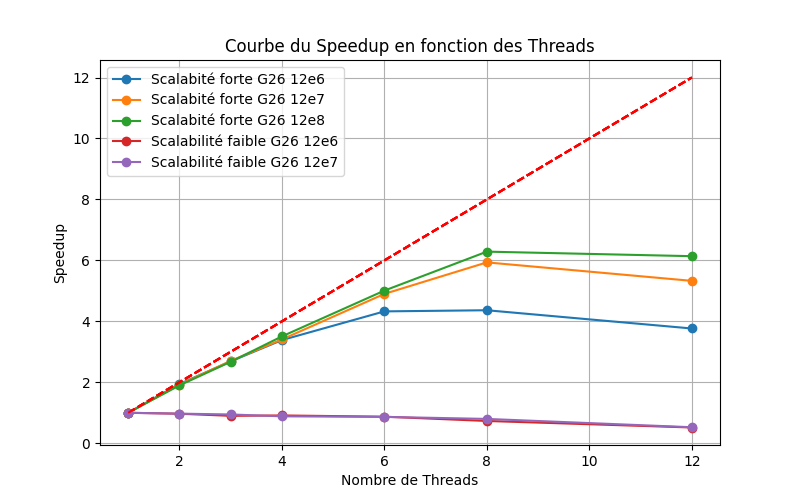

#### Erreur
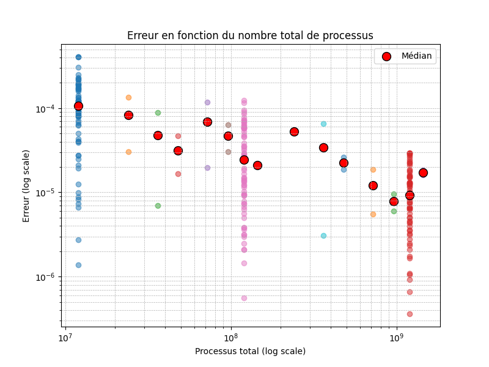

On peut remarquer que l'erreur a une tendance à diminuer lorsque le nombre de processus augmente.

### MasterSocket / WorkerSocket

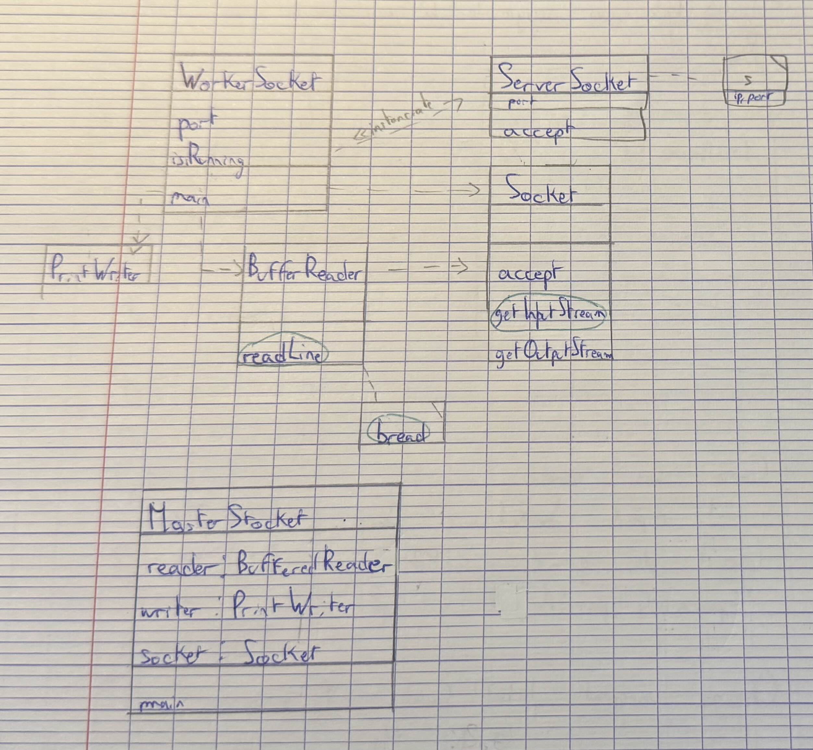
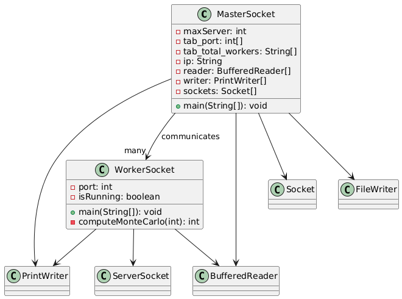

#### Fonctionnement
``Classe MasterSocket``

Cette classe orchestre l'exécution distribuée des tâches en :
* Se connectant aux Workers via des sockets TCP/IP.
* Envoyant le nombre d’itérations à exécuter.
* Attendant et collectant les résultats des Workers.
* Calculant l’estimation de 𝜋 à partir des résultats.
* Assure la gestion des connexions réseau et la coordination des Workers.

``Classe WorkerSocket``

Chaque Worker est un serveur qui :
* Attend une connexion d’un MasterSocket.
* Reçoit le nombre d’itérations à effectuer.
* Lance le calcul Monte Carlo :
  * Génère numIterations points aléatoires.
  * Compte combien tombent dans le quart de cercle.
  * Envoie son résultat au Master.
  * Se termine lorsque le Master envoie le message "END".

``Communication & Synchronisation``

* Le Master envoie des requêtes TCP aux Workers.
* Les Workers retournent leurs résultats au Master.
* Le Master attend la réponse de tous les Workers avant de calculer la valeur finale de 𝜋.

Cette architecture repose sur un modèle distribué avec sockets, ce qui permet d'exécuter le calcul sur plusieurs machines en parallèle. 

#### Scalabilité forte

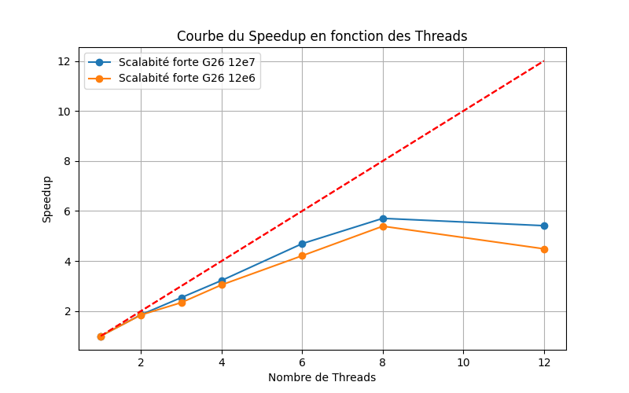

* Lorsque la charge de travail est plus élevée (12e7), le speedup est meilleur, ce qui signifie que le programme bénéficie mieux du parallélisme.
* À l'inverse, avec une charge plus faible (12e6), la scalabilité est moins bonne, indiquant un ratio communication/calcul défavorable.

Une charge de travail plus importante améliore la scalabilité, mais on ne parvient pas à atteindre un speedup idéal.

#### Scalabilité faible

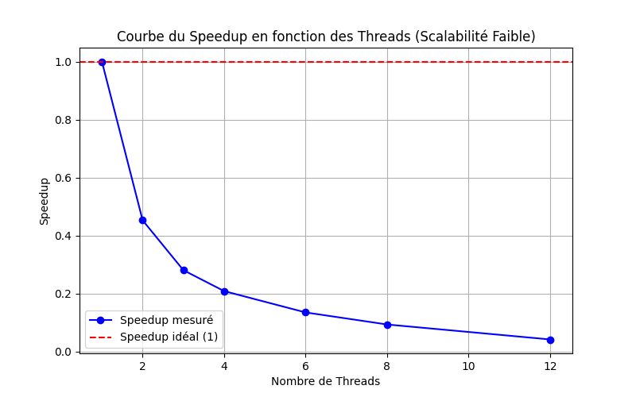

Le speedup décroît fortement avec l'augmentation du nombre de threads. 
Cela signifie que l'ajout de threads ralentit plutôt qu'il n'améliore les performances.

#### Comparaison

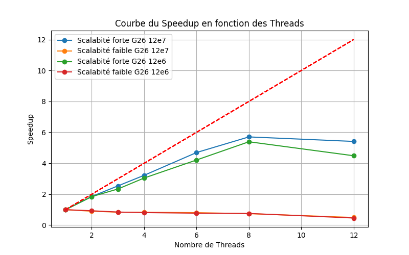


#### Erreur

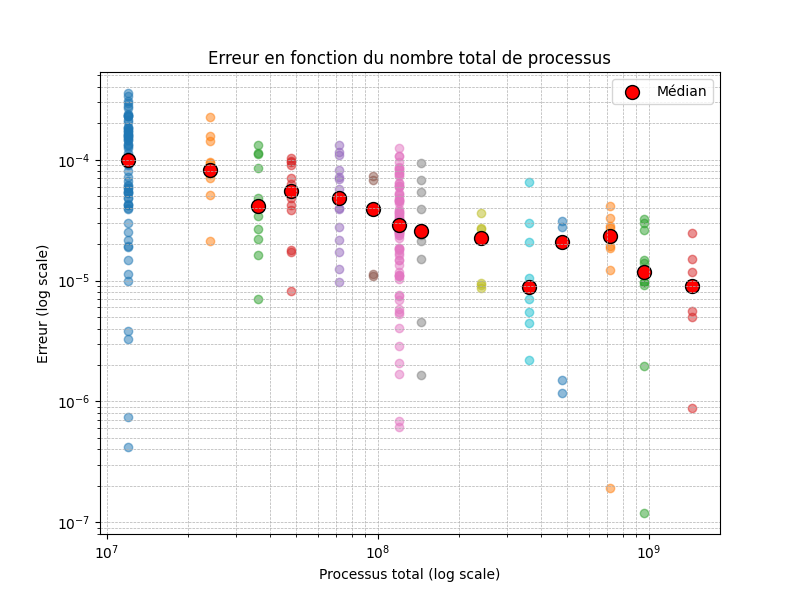

On observe que l'erreur médiane (points rouges) diminue globalement à mesure que le nombre de processus augmente,
ce qui est cohérent avec l'approche Monte Carlo : plus il y a d'itérations (ou de points simulés), plus l'estimation de π est précise.

L'augmentation du nombre de Workers améliore la précision du calcul, mais il peut y avoir une certaine variance en raison de la nature probabiliste de Monte Carlo.

### Dans la salle G26

Pour se rapprocher au mieux de la courbe idéale, on utilise plusieurs machines de la salle G26.

Un poste sera le master et les autres postes seront les différents workers.

#### Installation 
Pour commencer, il faut aller sur centos.
Il faut alors exécuter plusieurs commandes afin d'avoir le projet et de pouvoir le rendre fonctionnel.

Il faut installer java avec ```sudo yum install java-devel```.

Pour pouvoir se connecter aux autres machines, il faut alors désactiver le firewall. On peut le faire avec la commande
```sudo systemctl stop firewalld```

Il faut ensuite récupérer le projet avec ```gitclone``` et ensuite la compiler avec la commande ```make```.
Cela lancera le fichier Makefile qui compilera ainsi les différentes classes.

#### Expérience

On va faire une expérience de scalabilité faible. 
On va donc faire des calculs avec le nombre de processus allant de 1 à 64.

| **Nombre de processus** | **Nombre de thread** | **Temps (ms)** | **Erreur**            |
|-------------------------|----------------------|----------------|-----------------------|
| 1                       | 2e9                  | 68039          | x                     |
| 2                       | 4e9                  | x              | x                     |
| 4                       | 8e9                  | 70436          | 1.074792104395961E-5  |
| 8                       | 16e9                 | 70450          | 4.610508550924495E-6  |
| 16                      | 32e9                 | 70484          | 1.2763940615949628E-6 |
| 32                      | 64e9                 | 71908          | 2.8263219557848443E-6 |
| 64                      | 128e9                | 70890          | 1.3741649324992772E-6 |

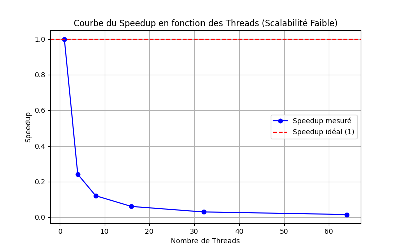

Avec cette méthode, on peut observer que l'on a un très bon graphe de scalabilité faible.
On peut en déduire que cette parallélisation est très efficace.


## Performance 

Pour étudier, les performances des codes, on utilise les normes **ISO/IEC 25010** et **ISO/IEC 25022**.

On utilise deux modèles pour évaluer les systèmes que l'on a mis en place.

### Quality In Use Model

Ce modèle permet d’évaluer la qualité d’un logiciel selon les besoins l’utilisateur final. 
Il met l’accent sur l’expérience réelle d’utilisation en prenant en compte divers critères essentiels, tels que l’efficacité, la fiabilité ou encore le confort. 
Ce modèle vise à mesurer la capacité d’un logiciel à répondre aux besoins des utilisateurs tout en minimisant les risques liés à son utilisation.


| **Critère**                                                                                | **Définition**                                                                                                      |
|--------------------------------------------------------------------------------------------|---------------------------------------------------------------------------------------------------------------------|
| **Efficacité (Efficiency)**                                                                | Capacité du système à permettre à l’utilisateur d’accomplir ses tâches en utilisant les ressources adéquates.       |
| **Efficacité fonctionnelle (Effectiveness)**                                               | Capacité du logiciel à aider l’utilisateur à atteindre ses objectifs de manière correcte et complète.               |
| **Utilité (Usefulness)**                                                                   | Pertinence du logiciel dans l’accomplissement de ses fonctions .                                                    |
| **Fiabilité et confiance (Trust)**                                                         | Degré de confiance de l’utilisateur dans la stabilité et la fiabilité du logiciel .                                 |
| **Expérience utilisateur agréable (Pleasure)**                                             | Niveau de satisfaction et de plaisir ressenti lors de l’utilisation, en particulier pour les nouveaux utilisateurs. |
| **Confort d’utilisation (Comfort)**                                                        | Facilité d’utilisation du logiciel, notamment en termes d’ergonomie et de modularité.                               |
| **Risques économiques (Economic risk)**                                                    | Coût lié à la maintenance du logiciel, aux mises à jour et aux éventuels problèmes financiers associés.             |
| **Réduction des risques pour la santé et la sécurité (Health and safety risk mitigation)** | Minimisation des dangers potentiels pour les utilisateurs.                                                          |
| **Réduction des impacts environnementaux (Environmental risk mitigation)**                 | Prévention des risques pour l’environnement.                                                                        |
| **Adéquation au contexte (Context completeness)**                                          | Capacité du logiciel à remplir efficacement son rôle dans un contexte d’utilisation spécifique.                     |
| **Flexibilité (Flexibility)**                                                              | Adaptabilité du logiciel à différents usages ou besoins sans nécessiter de modifications majeures.                  |


### Product Quality Model

Le Product Quality Model est un modèle qui permet d’évaluer la qualité d’un logiciel, indépendamment de son utilisation finale. 
Contrairement au Quality In Use Model, qui se concentre sur l’expérience utilisateur, le Product Quality Model analyse les caractéristiques internes et externes du logiciel pour déterminer s’il est bien conçu et performant.

Ce modèle repose sur plusieurs critères définis notamment par la norme ISO/IEC 25010, qui est une évolution de la norme ISO/IEC 9126. 
Voici les principales caractéristiques de la qualité d’un logiciel selon ce modèle :

| **Caractéristique**                                      | **Définition**                                                                                                                      |
|----------------------------------------------------------|-------------------------------------------------------------------------------------------------------------------------------------|
| **Fonctionnalité** (*Functional Suitability*)            | Capacité du logiciel à fournir des fonctions qui répondent aux besoins spécifiés de manière complète et correcte.                   |
| **Fiabilité** (*Reliability*)                            | Capacité du logiciel à fonctionner sans défaillance dans des conditions spécifiques pendant une période donnée.                     |
| **Performance et efficacité** (*Performance Efficiency*) | Utilisation optimale des ressources système pour garantir une bonne réactivité et un temps d’exécution acceptable.                  |
| **Compatibilité** (*Compatibility*)                      | Capacité du logiciel à fonctionner correctement dans différents environnements et à interagir avec d’autres systèmes.               |
| **Utilisabilité** (*Usability*)                          | Facilité avec laquelle un utilisateur peut comprendre, apprendre et utiliser le logiciel efficacement.                              |
| **Sécurité** (*Security*)                                | Protection des données et du système contre les accès non autorisés et les attaques.                                                |
| **Maintenabilité** (*Maintainability*)                   | Facilité de modification du logiciel pour corriger des erreurs, améliorer ses performances ou ajouter de nouvelles fonctionnalités. |
| **Portabilité** (*Portability*)                          | Capacité du logiciel à être transféré et utilisé sur différents environnements sans nécessiter de modifications importantes.        |

## Définition

* **Speedup** : L’accélération Sp est le gain de vitesse d’exécution en fonction du nombre
  de processus P. On l’exprime comme le rapport du temps d’éxécution sur
  un processus T1, sur le temps d’exécution sur P processus, Tp. On le calcule avec ```Sp = T1/Tp```
  On peut le représenter avec la courbe suivante :
  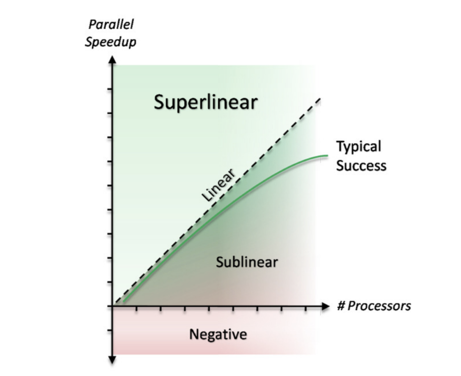

* **Scalabilité forte** : La scalabilité forte évalue la capacité d’un programme à diminuer son temps d’exécution lorsque le nombre de cœurs augmente, tout en conservant une charge de travail constante.
  Elle mesure ainsi l’efficacité avec laquelle le programme utilise les ressources supplémentaires.

* **Scalabilité faible** : La scalabilité faible mesure la capacité d’un programme à maintenir un temps d’exécution stable lorsque la charge de travail et le nombre de cœurs augmentent.
  Elle évalue dans quelle mesure le programme peut traiter efficacement une charge de travail croissante en exploitant davantage de ressources.

* **ISO/IEC 25010** : La norme **ISO/IEC 25010** est un standard international qui définit un modèle de qualité pour l'évaluation des logiciels et des systèmes informatiques.
  Elle appartient à la famille des normes SQuaRE (Software Product Quality Requirements and Evaluation).

* **ISO/IEC 25022** : La norme ISO/IEC 25022 fait partie de la série SQuaRE (Software Product Quality Requirements and Evaluation) et se concentre sur l'évaluation de la qualité en usage des systèmes et logiciels.

* **Future** : Une Future est un objet qui représente le résultat d'une tâche asynchrone qui s'exécutera dans le futur.
  Il agit comme un conteneur pour un résultat qui n'est pas encore disponible.
  Les Futures permettent de :
  * Vérifier si la tâche est terminée
  * Attendre que la tâche se termine et récupérer le résultat
  

## Conclusion

Ce rapport a exploré la méthode de Monte Carlo pour estimer la valeur de π et ses différentes implémentations en programmation parallèle et distribuée.
Nous avons analysé plusieurs approches, du parallélisme de boucle à l’architecture Master/Worker avec sockets, afin d’évaluer leur impact sur la scalabilité et la performance.

Les résultats montrent que la parallélisation de Monte Carlo n'est pas toujours efficace en raison des sections critiques limitant les gains de performance. 
L’approche Master/Worker, bien que plus scalable, souffre d’un coût de communication non négligeable. L’étude des métriques de performance à l’aide des normes ISO/IEC 25010 et ISO/IEC 25022 a permis de mieux comprendre les forces et limites de chaque implémentation.

En conclusion, bien que la méthode de Monte Carlo soit une solution élégante pour l’approximation de π, son efficacité en parallèle dépend fortement de l’architecture utilisée et de la gestion des ressources critiques.

Enfin, on a pu constater que la méthode qui utilise le mieux la parallélisation est le code Master/Worker socket. Si l'on exécute le code sur différente machine, 
donc plusieurs workers, la parallélisation fonctionne mieux, car on peut ainsi utiliser plus de cœurs différents.